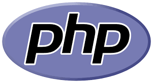

Mark Gatus
==========
Hi, I am Mark, I am currently studying a Bachelor of Computer Science @ [UNE](https://www.une.edu.au/) , majoring in both Software Development and Data Science. As of 2022 
I have 10 units left to complete the degree and hope to be done by the end of 2023.

Current Units
-------------
- Functional and Reactive Programming 
- Database Management Systems 
- Software Project Management.

Completed Units
---------------

| Introduction to Programming and the UNIX Environment    | Quantitative Skills With Applications | Introduction to Statistical Modelling    | 
| :---: | :---: | :---: |
| <b>Object Oriented Programming </b>  | <b>Software Dev. Studio </b>  | <b>Calculus and Linear Algebra</b> |
| <b>Discrete Maths</b> | <b>Software Dev. Studio 2 </b>  | <b>Operating Systems</b>  |
| <b>Data Structures and Algorithms</b>  | <b>Statistical Modelling & Experimental Design </b> | <b>Parallel & Distributed Computing</b>  |
| <b>Web Programming</b>  |

Contact
-------
markgatus@hotmail.com
